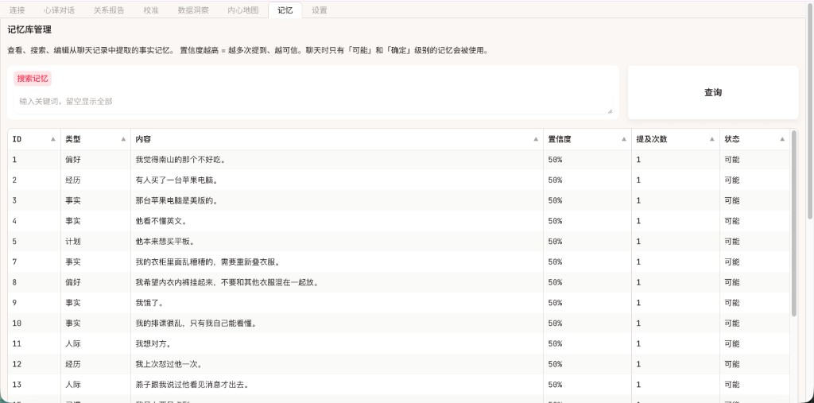

# 使用说明

本文档介绍浏览器控制台中**每个 Tab 的作用**与**推荐操作顺序**。配图见同目录下 [`images/`](images/)。

> **访问地址**：启动应用后，在浏览器打开 `http://127.0.0.1:7872`（或终端/控制台日志里打印的地址）。

---

## 界面总览：Tab 顺序

从左到右依次为：

| 顺序 | Tab 名称 | 说明 |
|------|----------|------|
| 1 | **连接** | 配置 API、准备解密、选择聊天对象、选择训练模式、**开始学习** |
| 2 | **心译对话** | 与「分身」聊天；可用 `@KK` 召唤关系顾问 |
| 3 | **关系报告** | 关系全景报告、沟通与依恋等分析 |
| 4 | **校准** | 情境题校准，用于细化思维与信念 |
| 5 | **数据洞察** | 消息量、联系人、时间分布等统计 |
| 6 | **内心地图** | 查看与搜索已抽取的「信念」条目 |
| 7 | **记忆** | 管理从聊天中抽取的结构化事实记忆 |
| 8 | **设置** | API、模型、路径等系统配置 |

**未完成首次学习前**，除「连接」「设置」外，其余 Tab 可能处于隐藏状态；完成学习并生成记忆库后会自动显示。

---

## 推荐流程（第一次使用）

1. **连接** → 填写 API（或在 **设置** 中填写并保存）→ 如需解密本机微信，按「准备」向导完成解密与依赖。
2. 在 **连接** 中**扫描并选择**要分析的聊天对象（TA）。
3. 选择 **训练模式**（训练自己 / 训练对象），点击 **开始学习**，等待 **学习进度** 跑完。
4. 到 **心译对话** 试聊；需要深度分析时打开 **关系报告**；需要更贴人格时到 **校准** 做题。
5. 需要自查数据与抽取结果时，使用 **数据洞察**、**内心地图**、**记忆**。

---

## 1. 连接

**作用**：一站式完成「能读到聊天数据 → 选对人和模式 → 训练出分身」。

### 1.1 训练模式

- **训练自己的分身**：从**你发出的消息**学习说话方式，适合「对方」来和「你的分身」说话。
- **训练对象的分身**：从**对方发出的消息**学习，适合你来和「TA 的分身」对话、理解 TA 的表达习惯。

### 1.2 开始学习与学习进度

1. 确认已选对象与训练模式无误。
2. 点击 **开始学习**（若已完成训练，按钮显示为 **重新学习**）。
3. 在 **学习进度** 文本框中查看实时日志：读消息、清洗，建对话段、加载/缓存嵌入与情感等小模型、思维训练、生成记忆库等。

> 详细安装与 API 配置步骤见 [安装文档](installation.md)。

### 1.3 解密（macOS 终端，可选）

若使用源码或安装包内的解密工具，在**本机微信已登录**的前提下，macOS 可能需要在终端对扫描器执行 `sudo`。下图为 `find_all_keys_macos` 扫描输出示例：

---

## 2. 心译对话

**作用**：与当前训练目标对应的 **TA 分身**对话。

- **左侧**：**新对话**、**最近对话**列表，可切换不同会话。
- **中间**：对话区，用户与分身、以及可选顾问消息。
- **底部输入框**：输入内容后发送。

**顾问 @KK**：在任意消息中输入 **`@KK`**（大小写不敏感），会召唤 **KK** 从关系视角给建议，例如「@KK 我们最近老吵架怎么办」。

---

## 3. 关系报告

**作用**：基于已导入与分析的聊天记录，生成**关系全景**类报告（沟通速写、情感分布、关系健康维度、依恋风格、情绪触发与核心信念等模块可能因版本与数据有所不同）。

- 使用页面上的 **生成关系全景报告**（或同类按钮）触发刷新。
- 报告为只读展示，便于整体把握「沟通习惯、情绪结构、关系张力」等。

---

## 4. 校准

**作用**：通过**情境题**（非简单问卷）收集你在冲突、信任、边界等场景下的选择，系统据此**反推**决策逻辑，并反馈到信念与思维模型，使分身更贴近真实反应。

- 建议在 **首次学习完成后**按学习进度提示进入本 Tab。
- 具体题目与交互以当前版本界面为准（详细心理学背景见 [技术架构文档](architecture.md#srccognitive--认知校准)）。

---

## 5. 数据洞察

**作用**：对当前已加载数据做**统计与可视化**，例如总消息数、活跃联系人、时间跨度、发送/接收比例、信念条目数、向量记忆段、联系人消息量 Top N、24 小时消息分布等。

- 点击 **刷新分析** 可重新计算（若数据有更新建议刷新）。

---

## 6. 内心地图

**作用**：展示从聊天中抽取的 **信念（Belief）** 表：主题、立场、前提条件、置信度、来源等。用于审阅「系统认为 TA 在各类话题下持什么立场」。

- **按主题搜索**：输入关键词后点 **查询**；留空表示列出全部（或当前页全部）。

---

## 7. 记忆

**作用**：管理 **MemoryBank** 中的结构化事实记忆（类型、内容、置信度、提及次数、状态等）。

- 使用 **搜索记忆** + **查询** 浏览与检索。

---

## 8. 设置

**作用**：配置 **API Key、Base URL、模型名、Provider** 等，并可查看连接与运行相关信息。修改后请 **保存**，以便对话与训练使用正确的模型与密钥。

首次使用若未在「连接」填写 API，也可在本 Tab 完成配置。

---

## 常见问题

**Q：对话时一直转圈或很久才出字？**  
A：首次调用会拉模型，建向量索引。连续失败请检查 **API Key 与网络**；打开 **设置** 看连接状态。

**Q：需要多少条聊天才有效果？**  
A：约 **30 条**有效双人对话起步；**300+** 效果明显，**1000+** 趋于稳定。

**Q：「训练自己」和「训练对象」能同时启用吗？**  
A：**一次只能一种**主模式。想两种都试，可用两套目录（两份安装文件夹或两份克隆仓库）分别训练。

**Q：会动我的微信数据吗？**  
A：解密阶段**只读**进程内存中的密钥并解密本地库副本，**不修改**微信客户端行为与官方数据文件（仍建议备份）。

**Q：聊天记录会传到你们服务器吗？**  
A：**不会**。数据在本地 `data/`；与**你配置的 API 服务商**之间的请求见 [隐私文档](privacy.md)。

完整 FAQ 与故障排除：[安装文档 → 故障排除](installation.md#故障排除)

---
