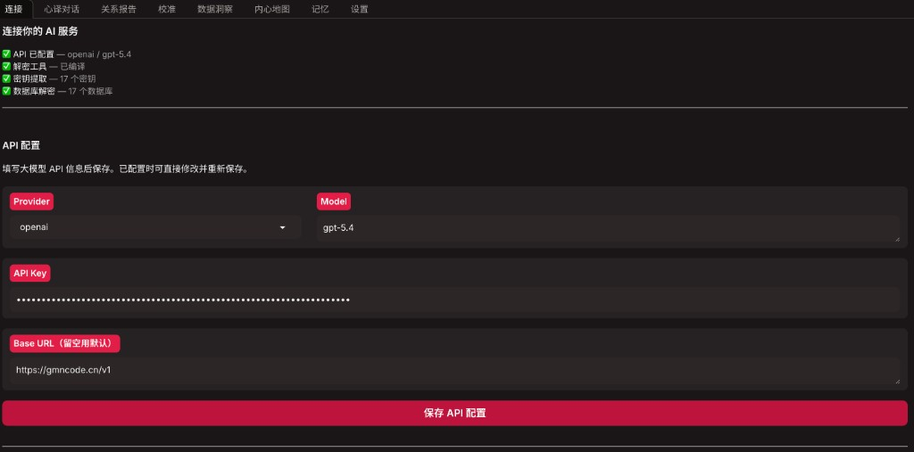

# 使用说明

本文档详细介绍 **心译（xinyi）** 的完整功能与操作流程，帮助你快速上手并深入理解每个模块的作用。

> **访问地址**：启动应用后，在浏览器打开 `http://127.0.0.1:7872`（或终端/控制台日志里打印的地址）。

---

## 界面总览

心译采用 **Tab 式导航设计**，共 8 个功能模块，从左到右依次排列：

| 顺序 | Tab 名称 | 核心功能 |
|:---:|----------|----------|
| 1 | **连接** | API 配置、微信解密、选择分析对象、选择训练模式、开始学习 |
| 2 | **心译对话** | 与「分身」聊天；支持 `@KK` 召唤关系顾问 |
| 3 | **关系报告** | 关系全景报告、沟通风格、情感分布、依恋类型分析 |
| 4 | **校准** | 情境题校准，细化思维与信念模型 |
| 5 | **数据洞察** | 消息量、联系人、时间分布等统计与可视化 |
| 6 | **内心地图** | 查看与搜索从聊天中抽取的「信念」条目 |
| 7 | **记忆** | 管理结构化事实记忆（类型、置信度、提及次数） |
| 8 | **设置** | API Key、模型、Base URL 等系统配置 |

**重要提示**：未完成首次学习前，除「连接」「设置」外，其余 Tab 处于隐藏状态；完成学习并生成记忆库后会自动显示。

---

## 推荐流程（第一次使用）

```
┌─────────────────────────────────────────────────────────┐
│  第1步  │  连接 Tab → 填写 API Key（或在设置中配置）      │
│         │  → 如需解密微信，按「准备」向导完成              │
├─────────────────────────────────────────────────────────┤
│  第2步  │  在「连接」中扫描并选择要分析的聊天对象（TA）     │
├─────────────────────────────────────────────────────────┤
│  第3步  │  选择训练模式 → 点击「开始学习」→ 等待进度完成   │
├─────────────────────────────────────────────────────────┤
│  第4步  │  进入「心译对话」试聊                           │
│         │  需要深度分析时打开「关系报告」                  │
│         │  需要更贴合人格时到「校准」做题                  │
├─────────────────────────────────────────────────────────┤
│  第5步  │  使用「数据洞察」「内心地图」「记忆」自查分析结果  │
└─────────────────────────────────────────────────────────┘
```

---

## 详细功能说明

### 1. 连接

这是整个应用的入口页面，一站式完成「能读到聊天数据 → 选对人和模式 → 训练出分身」。



#### 1.1 训练模式选择

心译提供两种训练模式，适应不同的使用场景：

| 模式 | 说明 | 适用场景 |
|------|------|----------|
| **训练自己的分身** | 从**你发出的消息**学习说话方式 | 对方来和「你的分身」对话，提前体验你的表达风格 |
| **训练对象的分身** | 从**对方发出的消息**学习 | 你和「TA 的分身」对话，深入理解 TA 的表达习惯 |

#### 1.2 学习进度监控

点击 **开始学习**（已完成训练后显示为 **重新学习**），可在学习进度文本框实时查看：

- 读取消息进度
- 数据清洗与预处理
- 构建对话段落
- 加载/缓存嵌入模型
- 情感分析模型初始化
- 思维模式训练
- 生成记忆库

> 详细安装与 API 配置步骤见 [安装文档](installation.md)。

#### 1.3 微信解密（可选）

若使用源码或安装包内的解密工具，在**本机微信已登录**的前提下，macOS 可能需要在终端对扫描器执行 `sudo`。


---

### 2. 心译对话

与当前训练目标对应的 **TA 分身**进行实时对话。


#### 界面布局

- **左侧边栏**：新对话、最近对话列表，支持切换不同会话
- **中间区域**：对话区，展示用户与分身、以及可选顾问的消息
- **底部输入框**：输入内容后发送

#### 顾问 @KK

在任意消息中输入 **`@KK`**（大小写不敏感），会召唤 **KK** 从关系视角给出专业建议。

**使用示例**：
- `我想和TA修复关系，@KK 有什么建议？`
- `@KK 我们最近老吵架怎么办`


---

### 3. 关系报告

基于已导入与分析的聊天记录，生成全方位的关系分析报告。


#### 报告模块（可能因版本有所不同）

| 模块 | 说明 |
|------|------|
| **沟通速写** | 对话风格、回复频率、用词习惯 |
| **情感分布** | 积极/消极/中性消息比例 |
| **关系健康维度** | 亲密、信任、支持等指标评估 |
| **依恋风格** | 安全型、焦虑型、回避型等分析 |
| **情绪触发点** | 容易引发情绪波动的话题 |
| **核心信念** | 关系中潜在的核心认知模式 |

**操作方式**：点击页面上的 **生成关系全景报告**（或同类按钮）触发刷新。报告为只读展示，便于整体把握沟通习惯、情绪结构、关系张力等。

---

### 4. 校准

通过**情境题**收集你在冲突、信任、边界等场景下的选择，系统据此反推决策逻辑，并反馈到信念与思维模型。


#### 特点

- **非简单问卷**：每道题都是真实情境场景题
- **深度洞察**：通过选择反推潜意识决策逻辑
- **动态校准**：校准结果实时反馈到分身模型

> 建议在 **首次学习完成后**按提示进入本 Tab。具体题目与交互以当前版本界面为准。

---

### 5. 数据洞察

对当前已加载数据做**统计与可视化分析**。


#### 可视化指标

| 指标类型 | 说明 |
|----------|------|
| **总消息数** | 累计消息总量 |
| **活跃联系人** | 有过互动的联系人数量 |
| **时间跨度** | 聊天记录的时间范围 |
| **发送/接收比例** | 你发送 vs 对方发送的消息比例 |
| **信念条目数** | 抽取的信念标签数量 |
| **向量记忆段** | 向量数据库中的记忆片段数 |
| **Top N 联系人** | 消息量排名靠前的联系人 |
| **24小时分布** | 消息发送的时间段分布图 |

**操作**：点击 **刷新分析** 可重新计算（如数据有更新建议刷新）。

---

### 6. 内心地图

展示从聊天中抽取的 **信念（Belief）** 关系图谱。


#### 信念条目属性

| 属性 | 说明 |
|------|------|
| **主题** | 信念涉及的话题领域 |
| **立场** | 在该主题下的核心观点 |
| **前提条件** | 支撑该立场的前提假设 |
| **置信度** | 系统对该信念的置信程度 |
| **来源** | 该信念抽取自哪些对话 |

**搜索功能**：输入关键词后点击 **查询**；留空表示列出全部条目。

---

### 7. 记忆

管理 **MemoryBank** 中的结构化事实记忆。


#### 记忆属性

| 属性 | 说明 |
|------|------|
| **类型** | 事实、偏好、习惯、事件等分类 |
| **内容** | 具体记忆文本 |
| **置信度** | 记忆的可靠程度 |
| **提及次数** | 该事实在对话中出现频率 |
| **状态** | 激活、归档、待确认等状态 |

**操作**：使用 **搜索记忆** + **查询** 浏览与检索记忆库。

---

### 8. 设置

配置系统运行所需的基础参数。


#### 可配置项

| 配置项 | 说明 |
|--------|------|
| **API Key** | LLM 服务商的密钥 |
| **Base URL** | API 端点地址 |
| **模型名称** | 使用的模型标识 |
| **Provider** | API 服务商选择 |

> 修改后请 **保存**，对话与训练将使用新的模型与密钥。首次使用若未在「连接」填写 API，也可在本 Tab 完成配置。

---

## 常见问题

**Q：对话时一直转圈或很久才出字？**  
A：首次调用会拉模型，建向量索引。连续失败请检查 **API Key 与网络**；打开 **设置** 看连接状态。

**Q：需要多少条聊天才有效果？**  
A：约 **30 条**有效双人对话起步；**300+** 效果明显，**1000+** 趋于稳定。

**Q：「训练自己」和「训练对象」能同时启用吗？**  
A：**一次只能一种**主模式。想两种都试，可用两套目录（两份安装文件夹或两份克隆仓库）分别训练。

**Q：会动我的微信数据吗？**  
A：解密阶段**只读**进程内存中的密钥并解密本地库副本，**不修改**微信客户端行为与官方数据文件（仍建议备份）。

**Q：聊天记录会传到你们服务器吗？**  
A：**不会**。数据在本地 `data/`；与**你配置的 API 服务商**之间的请求见 [隐私文档](privacy.md)。

完整 FAQ 与故障排除：[安装文档 → 故障排除](installation.md#故障排除)

---

## 技术背景

心译的核心架构包括：

- **数字分身训练**：从聊天记录中学习语言风格与思维模式
- **记忆系统**：向量检索 + 结构化事实记忆双重存储
- **信念抽取**：从对话中提取潜在的核心信念与价值观
- **认知校准**：情境题驱动的人格深度校准
- **关系分析**：多维度关系健康度评估

详细技术架构见 [架构文档](architecture.md)。
